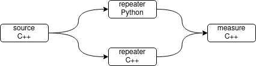

# ROS2 Latency Experiments

Package to compare pointcloud (PC) publishing latency using `rclypp` or `rclpy`.
Originally created to reproduce a performance issue in ROS2 Galactic (see bottom of this Readme).

## Getting Started

You need either PCL to create dummy pointclouds in the `source` node or any other pointcloud source (Gazebo, Realsense, ...).

1. Build the package
2. Run `ros2 launch ros2_latency experiment.launch.py megabytes:=<integer>`  
  (You can modify the payload size in `megabytes`)

### Nodes



* `source` (C++)  
  Publishes dummy pointcloud (PC) data of a specific size
* `repeater` (C++)  
  Copies the incoming PC and re-publishes on another topic
* `repeater.py` (Python)  
  Same as the C++ repeater, but using rclpy. A significant latency on the pub.publish(...) call is observed.
* `measure` (C++)
  Measures the age of an incoming PC by comparing the stamp with the current ROS time. This is to double-check if the latency is actually observed on the receiving end.

### Launch Files

* `experiment.launch.py`  
  Launches all nodes. Arguments:  
  * `megabytes` (int)
    The size of the created dummy pointcloud, to compare different sizes.

## Example Results

* ROS2 Humble (see Dockerfile)
* Cyclone DDS
* Laptop with AMD Ryzen 7 7840HS

### How to Interpret the Output

* The timings jitter a lot and typically start high and then calm down.
* You can filter for a specific value to get a better overview:  
  `ros2 launch ros2_latency experiment.launch.py megabytes:=1 | grep 'py: pub'`
* The order of log messages is not neccessarily chonogical with the events.
* In some RMW implementations, the publish() call is fast but the latency is actually much larger as the message is transported asyncronously. Therefore it's better to only compare actual message headers to system time.

### Output with 1 MB Pointclouds

(like from a LIDAR sensor)

```
# ros2 launch ros2_latency experiment.launch.py megabytes:=1

[source-1] [INFO] [1743271664.298787869] [ros2_latency]: source: creating 1 MB took 2633 [us]
[source-1] [INFO] [1743271664.298827794] [ros2_latency]: source: publishing took 475 [us]
[repeater-2] [INFO] [1743271664.311501135] [ros2_latency]: cpp: age of source pointcloud is 12490 [us]
[repeater-2] [INFO] [1743271664.311542984] [ros2_latency]: cpp: publishing took 355 [us]
[measure-4] [INFO] [1743271664.311948083] [ros2_latency]: cpp: age of repeated pointcloud is 797.915 [us]
[measure-4] [INFO] [1743271664.314298678] [ros2_latency]: py: age of repeated pointcloud is 195.696 [us]
[repeater.py-3] [INFO] [1743271664.314784198] [ros2_latency]: py: age of source PC is 15741 [us]
[repeater.py-3] [INFO] [1743271664.315268496] [ros2_latency]: py: publishing took    65 [us]
```

### Output with 10 MB Pointclouds

(like from a 640x480 RGBD camera)

```
# ros2 launch ros2_latency experiment.launch.py megabytes:=10

[source-1] [INFO] [1743271644.461064470] [ros2_latency]: source: creating 10 MB took 20850 [us]
[source-1] [INFO] [1743271644.461107140] [ros2_latency]: source: publishing took 3367 [us]
[repeater-2] [INFO] [1743271644.478285874] [ros2_latency]: cpp: age of source pointcloud is 14773 [us]
[repeater-2] [INFO] [1743271644.478336248] [ros2_latency]: cpp: publishing took 3598 [us]
[measure-4] [INFO] [1743271644.487652999] [ros2_latency]: cpp: age of repeated pointcloud is 12962 [us]
[measure-4] [INFO] [1743271644.495534039] [ros2_latency]: py: age of repeated pointcloud is 243.706 [us]
[repeater.py-3] [INFO] [1743271644.495938697] [ros2_latency]: py: age of source PC is 37503 [us]
[repeater.py-3] [INFO] [1743271644.496399601] [ros2_latency]: py: publishing took    88 [us]
```

### Summary

Just some values - not averaged and only to give a gut feeling.

| Measurement             | Meaning                                 | C++ Time [ms]        | Python Time [ms] |
|------------------------|------------------------------------------|----------------------|------------------|
| `age of source` (1MB)  | Let C++ publish 1 MB and receive it      | 12                   | 15               |
| `age of repeated` (1MB)| Publish 1 MB to a C++ node               | 0.7 or 11 (jitters)  | 0.2              |
| `age of source` (10MB) | Let C++ publish 10 MB and receive it     | 5.1 or 13 (jitters)  | 36               |
| `age of repeated` (10MB)| Publish 10 MB to a C++ node             | 12 or 5.0 (jitters)  | 0.4              |

I can't really explain why the C++ timing jitter that much. It's independent of the rate, or if the python node is also running. Maybe something with the buffer, how DDS handles the data or how the data is aligned in memory.

## Results for the Original Issue (Before ROS2 Foxy)

Everything below was created with commit [9cc0379](https://github.com/karl-schulz/ros2_latency/tree/66930700877550e94eb732f00082b426f4abf7c1), the results are slightly different!

Issue (has been solved)

* `rclpy` Github issue: https://github.com/ros2/rclpy/issues/763  
* Question on answers.ros.org: https://answers.ros.org/question/375827/ros2-performance-rclpy-is-30x-100x-slower-than-rclcpp/

Tested on a fast desktop system with:

* Ryzen 3800X CPU
* 16GB RAM
* SSD

### Comparison with 1 MB Pointclouds

(like from a LIDAR sensor)

```
# ros2 launch ros2_latency experiment.launch.py megabytes:=1


[source-1]      [INFO] [1617894568.132222845] [ros2_latency]: creating   took 3898 [us]
[source-1]      [INFO] [1617894568.132272495] [ros2_latency]: publishing took 118 [us]
[repeater-2]    [INFO] [1617894568.133056859] [ros2_latency]: copying    took 121 [us]
[repeater-2]    [INFO] [1617894568.133102729] [ros2_latency]: publishing took 116 [us]
[measure-4]     [INFO] [1617894568.133555481] [ros2_latency]: age of pointcloud via cpp is 611.183 [us]
[repeater.py-3] [INFO] [1617894568.145218816] [ros2_latency]: Age of source PC is  1346 [us]
[repeater.py-3] [INFO] [1617894568.145447607] [ros2_latency]: Copying took    92 [us]
[repeater.py-3] [INFO] [1617894568.145639368] [ros2_latency]: Publishing took 11310 [us]
[measure-4]     [INFO] [1617894568.145463717] [ros2_latency]: age of pointcloud via py  is 13350 [us]
```

*-> Publishing the PC via Python takes 11ms, via C++ only 0.12ms*

### Comparison with 10 MB Pointclouds

(like from a 640x480 RGBD camera)

```
# ros2 launch ros2_latency experiment.launch.py megabytes:=10

[source-1]      [INFO] [1617894523.025022662] [ros2_latency]: creating   took 28423 [us]
[source-1]      [INFO] [1617894523.025084873] [ros2_latency]: publishing took 1406 [us]
[repeater-2]    [INFO] [1617894523.035501434] [ros2_latency]: copying    took 2006 [us]
[repeater-2]    [INFO] [1617894523.035576994] [ros2_latency]: publishing took 2321 [us]
[measure-4]     [INFO] [1617894523.041298005] [ros2_latency]: age of pointcloud via cpp is 8112.71 [us]
[repeater.py-3] [INFO] [1617894523.133180090] [ros2_latency]: Age of source PC is 11477 [us]
[repeater.py-3] [INFO] [1617894523.133437451] [ros2_latency]: Copying took  1961 [us]
[repeater.py-3] [INFO] [1617894523.133638792] [ros2_latency]: Publishing took 95739 [us]
[measure-4]     [INFO] [1617894523.137496766] [ros2_latency]: age of pointcloud via py  is 113877 [us]
```

*-> Publishing the PC via Python takes 96ms, via C++ only 2.3ms*
